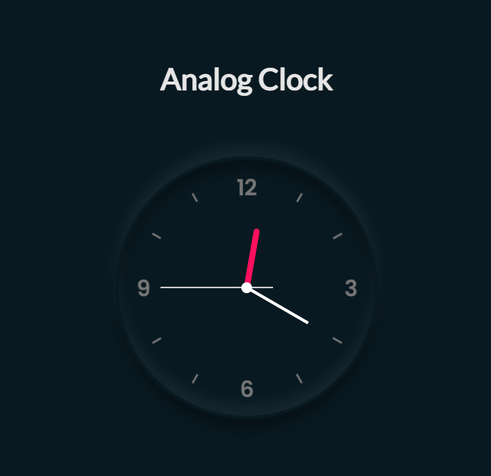
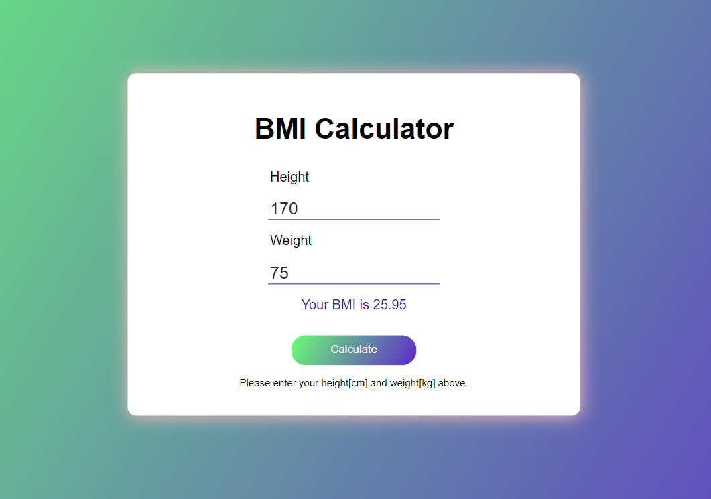
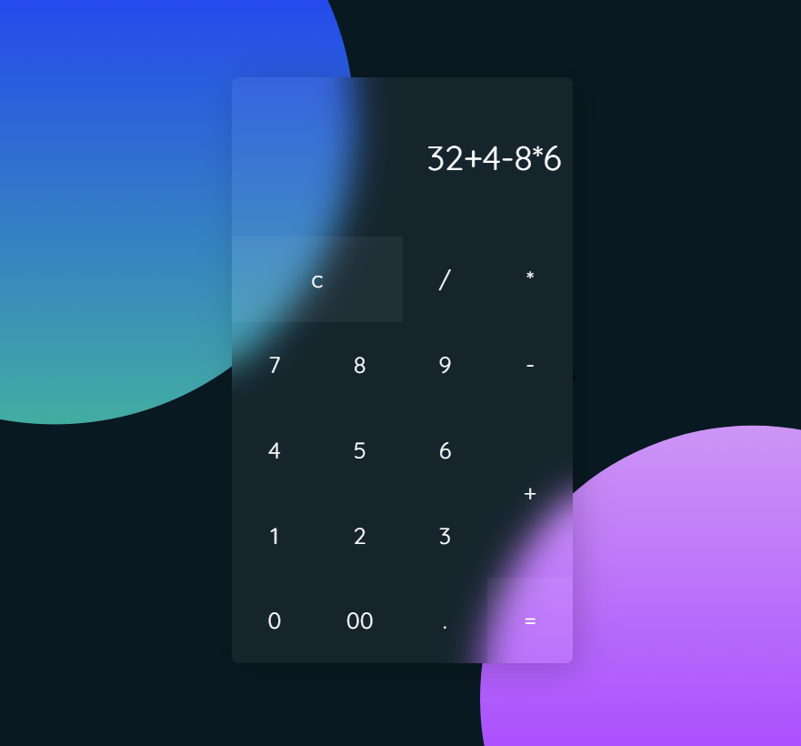
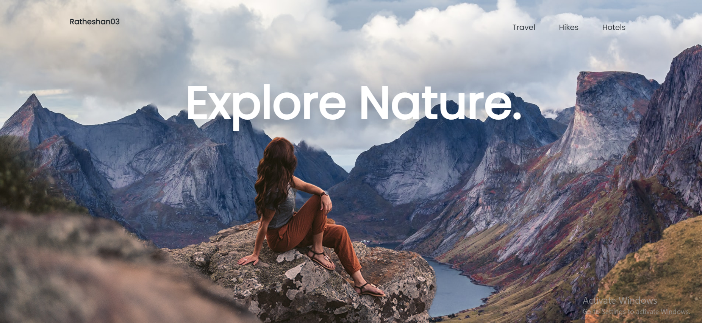
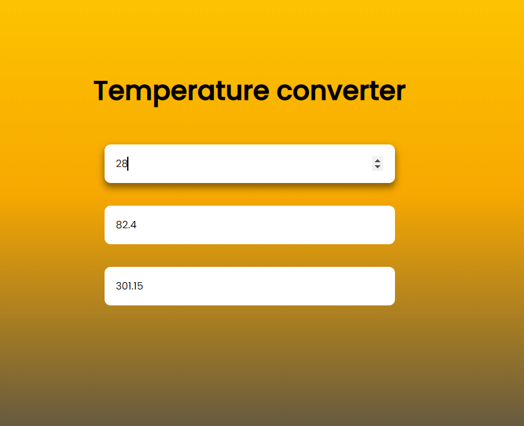
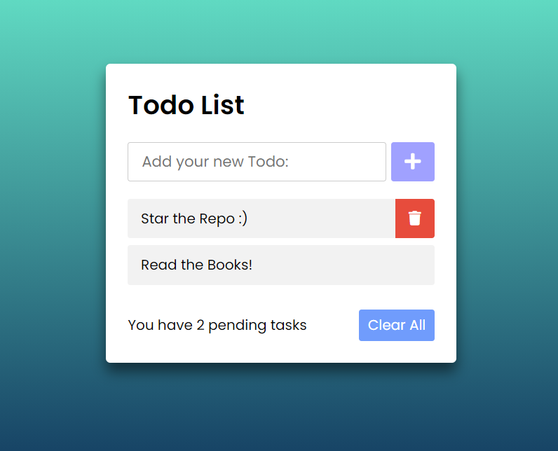
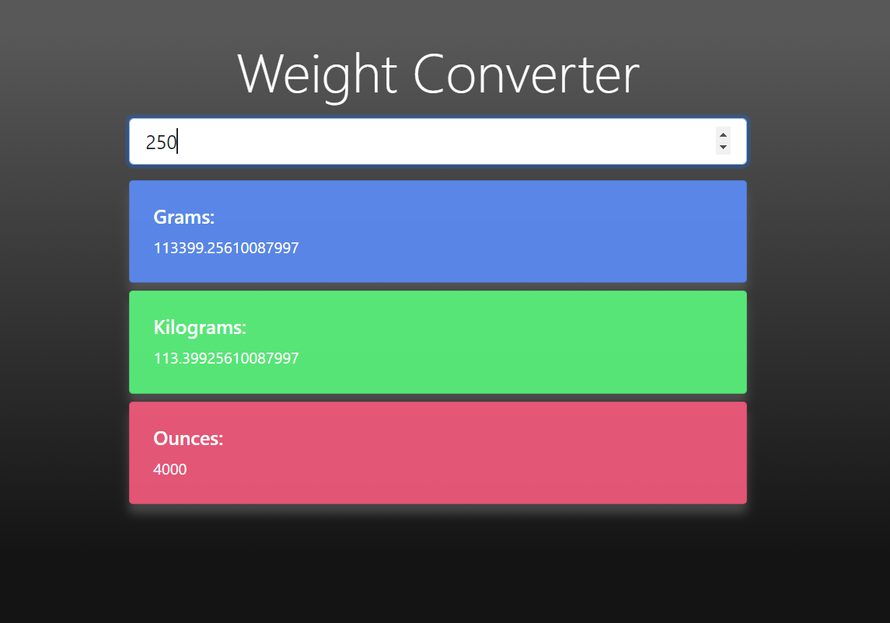

## 12 JavaScript Projects for Beginners 🚀

Sharpen your JavaScript skills by building 12 projects using Pure Js without any frameworks.
It has well structured with comments for explainations and it is very easy to understand every bit of code.

### Project List:

<ol>
    <li>
    
3D Card Animation 😃

    
    </li>
     
    <li>
    
 Analog Clock 🕙

    
    </li>
     
    <li>
    
BMI Calculator 📲

    
    </li>
     
    <li>
    
 Calculator 📱

    
    </li>
     
    <li>
    
 Countdown ⏲️

    
    </li>
     
    <li>
    
 Dynamic Calendar 📅

    
    </li>
     
    <li>
    
 Music Player 🎵

    
    </li>
     
    <li>
    
 Parallax website 🍀

    
    </li>
     
    <li>
    
 Temperature converter 🌤️

    
    </li>
     
    <li>
    
Todo list 📖

    
    </li>
     
    <li>
    
 Weather app ⛈️

    
    </li>
     
    <li>
    
  Weight converter 🙇‍♂️

    
    </li>
     
</ol>

### If u liked my projects and the code was useful to you, feel free to leave a star (much appreciated 😃), fork it and customize the projects as you like! :)
### Thankyou.
.
.
.
⏩ This Repo is Licensed under the [MIT License](LICENSE).
